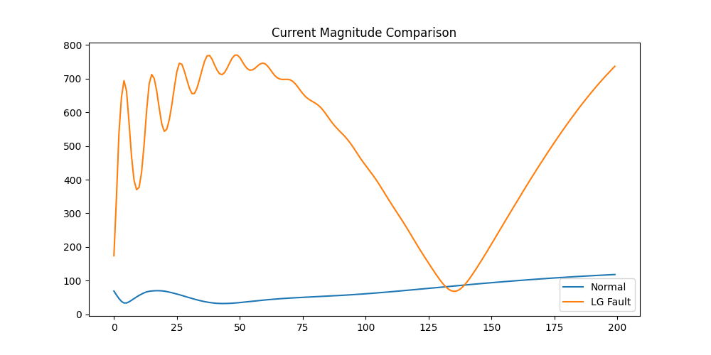
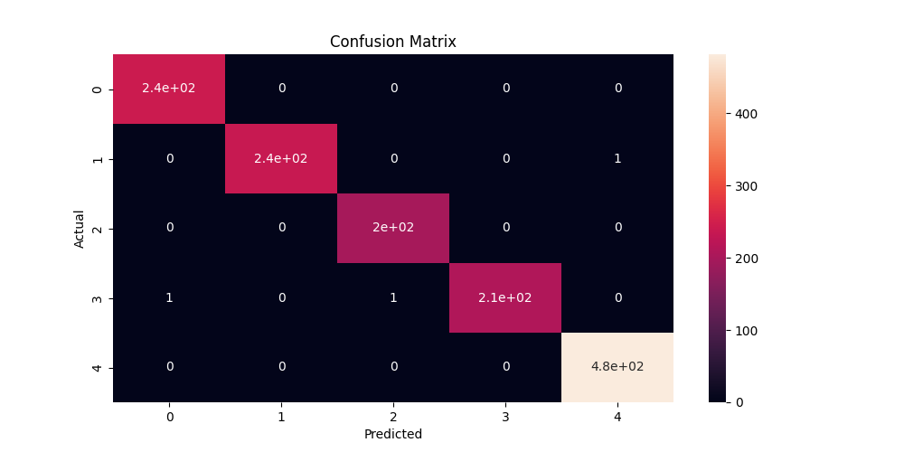

# ⚡ Power System Fault Detection using Machine Learning

## 📌 Overview
This project focuses on detecting and classifying faults in a three-phase power system using machine learning techniques based on electrical signal measurements.

Fault detection is a critical task in electrical engineering systems, as undetected faults can lead to equipment damage, power outages, and safety risks. This project aims to simulate a data-driven approach for identifying different fault conditions using current and voltage signals.

---

## ⚙️ Problem Statement
In real-world power systems, faults such as:
- Line-to-Ground (LG)
- Line-to-Line (LL)
- Double Line-to-Ground (LLG)
- Three-phase faults (LLL, LLLG)

cause **imbalances in current and voltage signals**.

Traditional protection systems rely on relays and thresholds, but they may fail under complex conditions. This project explores whether machine learning can improve fault classification accuracy.

---

## 🔍 System Approach

The workflow of the system is:

Sensor Data (Ia, Ib, Ic, Va, Vb, Vc)
↓
Feature Engineering (Imbalance, Ratios)
↓
Machine Learning Model
↓
Fault Classification

---

## 🧠 Feature Engineering (Key Insight)

Faults disturb the symmetry of a three-phase system.

To capture this behavior, the following features were engineered:

- Current imbalance:
  - (Ia - Ib), (Ib - Ic), (Ic - Ia)
- Voltage imbalance
- Ratio-based features between phases
- Magnitude-based features

These features significantly improved the model’s ability to distinguish between symmetrical and unsymmetrical faults.

---

## 📊 Dataset

- Input Features:
  - Ia, Ib, Ic (Phase Currents)
  - Va, Vb, Vc (Phase Voltages)

- Output Classes:
  - No Fault
  - LG
  - LLG
  - LLL
  - LLLG

> Note: The dataset is simulated and represents different fault conditions in a controlled environment.

---

## 🤖 Model Used

- Random Forest Classifier

Why Random Forest?
- Handles non-linearity well
- Robust to noise
- Performs well on tabular electrical data

---

## 📈 Results

- Accuracy: ~94% (baseline) → improved close to 100% after feature engineering
- Strong classification for:
  - LG
  - LLG
  - No Fault

- Minor confusion observed between:
  - LLL and LLLG (before feature improvement)

---

## 📊 Visual Analysis

### 🔹 Current Magnitude Comparison

LG fault shows significant deviation in current magnitude compared to normal conditions, indicating phase imbalance.

---

### 🔹 Voltage Imbalance

Fault conditions introduce noticeable fluctuations and imbalance in voltage signals, which are minimal during normal operation.

---

### 🔹 Confusion Matrix

The confusion matrix shows high classification accuracy across most fault types, validating the effectiveness of feature engineering.

---

## ⚠️ Limitations

- Dataset is simulated (not real-time industrial data)
- Noise and measurement errors not considered
- No real-time deployment or hardware integration yet

---

## 🚀 Future Improvements

- Integrate real-time sensor data (IoT-based system)
- Apply deep learning for time-series fault detection
- Deploy model on embedded systems for real-time monitoring
- Build dashboard for live fault visualization

---

## 🛠️ Tech Stack

- Python
- Pandas, NumPy
- Scikit-learn
- Matplotlib

---

## 📂 Project Structure

Fault_Prediction/
│
├── data/
├── images/
├── model/
├── notebook/
├── README.md
├── requirements.txt

---

## 💡 Key Takeaway

This project demonstrates how **electrical engineering concepts (phase imbalance)** can be combined with **machine learning** to build an intelligent fault detection system.

---

## 👩‍💻 Author

Sejal Patil